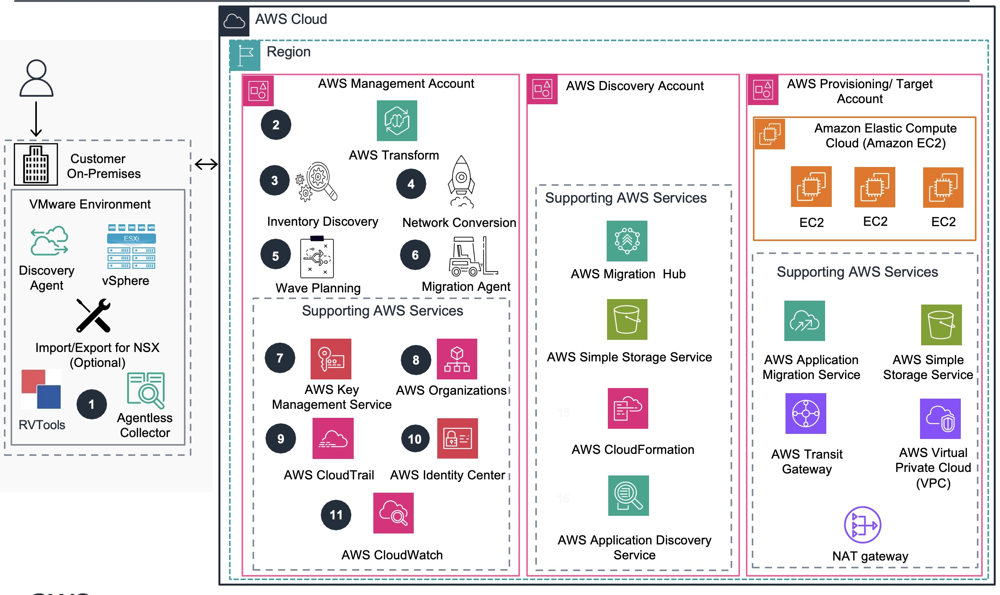
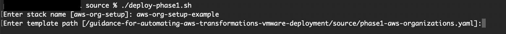
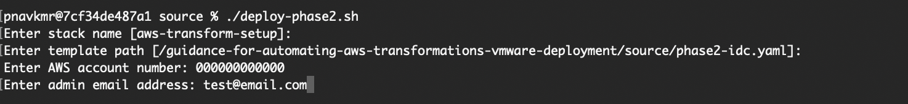

# Guidance for Migrating VMWare Workloads Using AWS Transform for VMWare on AWS

<!--
The Guidance title should be consistent with the title established first in Alchemy.

**Example:** *Guidance for Product Substitutions on AWS*

This title correlates exactly to the Guidance it’s linked to, including its corresponding sample code repository. 
-->

## Table of Contents

1. [Overview](#overview)
    - [Architecture](#architecture)
    - [Cost](#cost)
3. [Prerequisites](#prerequisites)
    - [Operating System](#operating-system)
4. [Deployment Steps](#deployment-steps)
5. [Deployment Validation](#deployment-validation)
6. [Running the Guidance](#running-the-guidance)
8. [Cleanup](#cleanup)
11. [Authors](#authors-optional)

## Overview

1. This Guidance provides an automated approach to deploying AWS Transform VMware resources using Infrastructure as Code (IaC). It streamlines the setup process by automating the provisioning of required AWS services, network configurations, and security controls. The solution accelerates time-to-value for organizations migrating VMware workloads while ensuring adherence to AWS best practices and security standards.
<!--
Provide a brief overview explaining the what, why, or how of your Guidance. You can answer any one of the following to help you write this:

    - **Why did you build this Guidance?**
    - **What problem does this Guidance solve?**
-->

### Architecture

<!-- 2. Include the architecture diagram image, as well as the steps explaining the high-level overview and flow of the architecture. 
    - To add a screenshot, create an ‘assets/images’ folder in your repository and upload your screenshot to it. Then, using the relative file path, add it to your README. -->
Below is the Reference architecture for the guidance showing the core and supporting AWS services: 

The journey begins with a thorough discovery and assessment of your on-premises VMware environment 
(1). **AWS Transform for VMware** supports multiple discovery methods, including RVTools for VMware inventory collection, AWS Application Discovery Agent (Discovery Agent) for gathering network communication patterns between applications and servers, Application Discovery Service Agentless Collector (Agentless Collector) for non-intrusive collection of TCP/IP network connections and process data, and ModelizeIT for additional network dependency mapping. These tools help build a comprehensive view of application-to-application communications, server-to-server dependencies, and overall network topology.

The **Inventory Discovery Agent** (3) collects crucial data from your on-premises environment and stores it securely in both Amazon Simple Storage Service (Amazon S3) buckets (14) within the AWS Discovery account (12) and AWS Migration Hub (13). This data forms the foundation for informed migration planning and is further processed by Migration Hub (13) and AWS Application Discovery Service (16). AWS Transform works together with these services to provide a single place to track migration progress and collect server inventory and dependency data, which is essential for successful application grouping and wave planning.

**Intelligent network conversion and wave planning**
With a comprehensive understanding of your environment, AWS Transform for VMware moves to the next critical phase. The Network Conversion Agent (4) automates the creation of AWS CloudFormation templates (15) to set up the target network infrastructure. These templates make sure your cloud environment closely mirrors your on-premises setup, simplifying the setup for the migration.

Meanwhile, the Wave Planning Agent (5) uses advanced graph neural networks to analyze application dependencies and plan optimal migration waves. This minimizes complex portfolio and application dependency analysis, and provides ready-to-migrate wave plans, resulting in smooth migrations.

**Enhanced security and compliance**
Security remains paramount throughout the migration process. AWS Key Management Service (AWS KMS) (7) provides robust encryption for stored data, conversation history, and artifacts when a customer managed key (CMK) is configured. AWS Organizations (8) enables centralized management across multiple AWS accounts, and AWS CloudTrail (9) captures and logs API calls for a complete audit trail.

Access control is managed through AWS Identity and Access Management (IAM) (10), providing centralized access management across AWS accounts. Amazon CloudWatch (11) continuously monitors AWS Transform service activities, resource utilization, and operational metrics within the management account (2), providing full visibility and control throughout the migration process.

**Orchestrated migration execution**
When it’s time to execute the migration, the Migration Agent (6) orchestrates the migration and cutover process. It works in tandem with AWS Application Migration Service (19) to replicate source servers to Amazon Elastic Compute Cloud (Amazon EC2) instances (18) based on the carefully planned waves and groupings.

The AWS Provisioning/Target Account (17) serves as the production environment where your migrated applications will reside. This account contains the target infrastructure and will house your production workloads after migration is complete. S3 buckets (20) in this account store the CloudFormation templates used for infrastructure deployment, providing a smooth, consistent, and reliable setup process.

**Flexible network configuration**
AWS Transform for VMware offers two networking models to suit different requirements:

·     Hub-and-spoke model – AWS Transit Gateway (21) connects virtual private clouds (VPCs) through a central hub VPC with shared NAT gateways. This model is ideal for centralized management and shared services.
·     Isolated model – Each VPC operates independently, connected directly by Transit Gateway. This approach offers greater isolation and is suitable for environments with strict separation requirements.

VPCs (22) created by AWS Transform match your on-premises network segments, providing a seamless transition. NAT gateways (23) provide outbound internet access for private subnets, maintaining security while enabling necessary connectivity. In hub-and-spoke deployments, shared NAT gateways are used in the central hub VPC, whereas in isolated deployments, individual NAT gateways are created for each VPC.

For complete setup instructions and requirements, please refer to the Implementation Guide.

### Cost

You are responsible for the cost of the AWS services used while running this Guidance. The following table provides a sample cost breakdown for the services deployed as part of this guidance. 
**Note : We are not including cost of services used to run the guidance or variable subsequent compute cost of migrated servers.**

### Cost Table

| AWS service  | Dimensions | Cost [USD] |
| ----------- | ------------ | ------------ |
| AWS IAM Identity Center | number of users  |  free |
| AWS Organizations | number of accounts in organization | free |
| Amazon Lambda | 1M requests | $0.20 |

We recommend creating a [Budget](https://docs.aws.amazon.com/cost-management/latest/userguide/budgets-managing-costs.html through [AWS Cost Explorer](https://aws.amazon.com/aws-cost-management/aws-cost-explorer/) to help manage costs. Prices are subject to change. For full details, refer to the pricing webpage for each AWS service used in this Guidance.

## Prerequisites

### Third-party tools (If applicable)

The machine running this guidance needs to support bash or powershell scripts. Alternatively, the parameters can be manually added to the CloudFormation YAML files. 

### AWS account requirements (If applicable)

An AWS Account with admin access is required to run the scripts that will enable AWS organization and the Identity Center groups. 

### Service limits  (if applicable)

AWS Transform Service Quotas:
https://docs.aws.amazon.com/transform/latest/userguide/transform-limits.html

### Supported Regions (if applicable)

AWS Transform Supported Regions:
https://docs.aws.amazon.com/transform/latest/userguide/regions.html

## Deployment Steps

## Deployment Process

### Clone repository 
1. Log in to your AWS account on your CLI/shell through your preferred auth provider.
2. Clone the code repository using command:
    git clone https://github.com/aws-solutions-library-samples/guidance-for-automating-aws-transformations-vmware-deployment

### Phase 1: Set up AWS Organizations

**Note : If you already have AWS Organizations enabled in your Management account, you can skip phase 1.**

3. Change directory to the source folder inside the repository:
    cd guidance-for-automating-aws-transformations-vmware-deployment/source
4. Start by running the first bash script: ./deploy-phase1.sh (This creates an AWS Organization with all features enabled) 

**Note : A Powershell script is available for Windows OS. Alternatively, the parameters can be manually added to the CloudFormation YAML.**

5. Pass in the following paramters using the bash script:
    STACK_NAME: name of cloudformation stack.
    TEMPLATE_PATH: path to phase1 yaml.  

6. After successful deployment, you'll need to manually enable an organization instance of IAM Identity Center in the AWS Console (Wait a few minutes for the changes to propagate)

### Phase 2: Set up IAM Identity Center and AWS Transform
1. After enabling IAM Identity Center manually and waiting for it to propagate, run: ./deploy-phase2.sh
2. Pass in the following parameters using the bash script:
    STACK_NAME: name of cloudformation stack.
    TEMPLATE_PATH: path to phase2 yaml.
    ACCOUNT_NUMBER: AWS account number.
    IDENTITY_CENTER_ID: AWS Identity Center ID.
    ADMIN_EMAIL: Email for admin user provisioned by script. 
**Note : A Powershell script is available for Windows OS. Alternatively, the parameters can be manually added to the CloudFormation YAML.**

This script will:
   - Create IAM Identity Center groups and users
   - Set up the necessary IAM policies for AWS Transform for both groups
   - Create an Admin user using lambda functions in Identity Center based on a provided email
   
**Note : Our script uses the deployed lambda functions to add the provided email as an Admin in the created AWS Transform Admin group in AWS IAM Identity Center. Subsequent admins and users can be added through the console following best practice.**

## Deployment Validation

* Open CloudFormation console and verify the status of the stacks

* Open Identity Center and verify the created groups

* View the admin group and verify created user

* Make sure the groups can be added to AWS Transform

* Make sure the start URL can be accessed by Admin user

## Running the Guidance

**Note : Please make sure the discovery and target accounts have been added as members to the organization.**

Explore our self-guided demo to learn how AWS Transform for VMware Service streamlines your VMware workload modernization. See how it automates key processes including application discovery, dependency mapping, network translation, wave planning, and server migration—all while optimizing Amazon EC2 instance selection for peak performance:

https://aws.storylane.io/share/qye0se68an9i

## Cleanup

When you no longer need to use the guidance, you should delete the AWS resources deployed by it in order to prevent ongoing charges for their use.

In the AWS Management Console, navigate to CloudFormation and locate the 2 guidance stacks deployed.
Starting with the most recent stack (not including any nested stacks), select the stack and click Delete button:

## Authors 

Pranav Kumar,
Patrick Kremer, 
Kiran Reid, 
Saood Usmani,
Daniel Zilberman 
