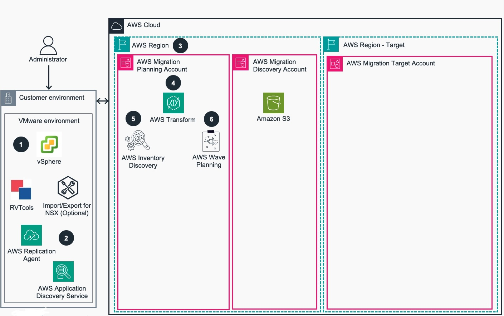

# Guidance for Automated Setup of AWS Transform for VMware

## Table of Contents

1. [Overview](#overview)
    - [Architecture](#architecture)
    - [Services in this guidance](#aws-services-in-this-guidance)
    - [Cost](#cost)
1. [Prerequisites](#prerequisites)
    - [Operating System](#operating-system)
1. [Deployment Steps](#deployment-steps)
1. [Deployment Validation](#deployment-validation)
1. [Running the Guidance](#running-the-guidance)
1. [Cleanup](#cleanup)
1. [Authors](#authors-optional)

## Overview

This Guidance provides an automated approach to deploying AWS Transform for VMware resources using Infrastructure as Code (IaC). It streamlines the setup process by automating the provisioning of required AWS services, network configurations, and security controls. The guidance accelerates time-to-value for organizations migrating VMware workloads while ensuring adherence to AWS best practices and security standards.

The journey begins with a thorough discovery and assessment of your on-premises VMware environment 
1. **AWS Transform for VMware** supports multiple discovery methods: 

- RVTools for VMware inventory collection
- AWS Application Discovery Agent (Discovery Agent) for gathering network communication patterns between applications and servers 
- Application Discovery Service Agentless Collector (Agentless Collector) for collecting communication data without installing an agent
These tools help build a comprehensive view of application-to-application communications, server-to-server dependencies, and overall network topology.

2. **Inventory Discovery Agent** collects crucial data from your on-premises environment and stores it securely in both Amazon Simple Storage Service (Amazon S3) buckets within the AWS Discovery account and AWS Migration Hub. This data forms the foundation for informed migration planning and is further processed by Migration Hub and AWS Application Discovery Service. AWS Transform works together with these services to provide a single place to track migration progress and collect server inventory and dependency data, which is essential for successful application grouping and wave planning.

3. **Intelligent network conversion and wave planning**
With a comprehensive understanding of your environment, AWS Transform for VMware moves to the next critical phase. The Network Conversion Agent automates the creation of AWS CloudFormation templates to set up the target network infrastructure. These templates make sure your cloud environment closely mirrors your on-premises setup, simplifying the setup for the migration.

Meanwhile, the Wave Planning Agent uses advanced graph neural networks to analyze application dependencies and plan optimal migration waves. This minimizes complex portfolio and application dependency analysis, and provides ready-to-migrate wave plans, resulting in smooth migrations.

4. **Enhanced security and compliance**
Security remains paramount throughout the migration process. AWS Key Management Service (AWS KMS) provides robust encryption for stored data, conversation history, and artifacts when a customer managed key (CMK) is configured. AWS Organizations enables centralized management across multiple AWS accounts, and AWS CloudTrail captures and logs API calls for a complete audit trail.

Access control is managed through AWS Identity and Access Management (IAM), providing centralized access management across AWS accounts. Amazon CloudWatch continuously monitors AWS Transform service activities, resource utilization, and operational metrics within the management account, providing full visibility and control throughout the migration process.

5. **Orchestrated migration execution**
When it’s time to execute the migration, the Migration Agent orchestrates the migration and cutover process. It works in tandem with AWS Application Migration Service to replicate source servers to Amazon Elastic Compute Cloud (Amazon EC2) instances based on the carefully planned waves and groupings.

The AWS Provisioning/Target Account serves as the production environment where your migrated applications will reside. This account contains the target infrastructure and will house your production workloads after migration is complete. S3 buckets in this account store the CloudFormation templates used for infrastructure deployment, providing a smooth, consistent, and reliable setup process.

6. **Flexible network configuration**
AWS Transform for VMware offers two networking models to suit different requirements:

- Hub-and-spoke model – AWS Transit Gateway connects virtual private clouds (VPCs) through a central hub VPC with shared NAT gateways. This model is ideal for centralized management and shared services.
- Isolated model – Each VPC operates independently, connected directly by Transit Gateway. This approach offers greater isolation and is suitable for environments with strict separation requirements.

VPCs created by AWS Transform match your on-premises network segments, providing a seamless transition. NAT gateways provide outbound internet access for private subnets, maintaining security while enabling necessary connectivity. In hub-and-spoke deployments, shared NAT gateways are used in the central hub VPC, whereas in isolated deployments, individual NAT gateways are created for each VPC.

### Architecture

Below is the Reference architecture for the guidance showing the core and supporting AWS services: 

<p align="center">

<br/>
Figure 1. Automated Setup of AWS Transform for VMware -  Environment setup and Access configuration.
</p>

<br/>1. Customer VMware environment hosts the workloads to be migrated. RVTools can be used along with optional import/export functionality for customers running VMware NSX. 
<br/>2. AWS agent and agentless Discovery agents used (in addition to or instead of RVTools) to gather and collect data and dependencies for migration. AWS Replication Agent is used to migrate virtual machines to AWS.
<br/>3. AWS Transform for VMware discovery workspaces are available globally. 
A full list of supported AWS Regions can be found [here](https://docs.aws.amazon.com/transform/latest/userguide/regions.html). 
<br/>4. AWS Transform for VMware helps optimize infrastructure and reduce operational overhead, giving you a more predictable, cost-efficient path to modernization.
<br/>5. The Inventory Discovery capability collects data from the on-premises environment and stores it in the Discovery account’s Amazon Simple Storage Service (S3) buckets.
<br/>6. As part of AWS Transform, the Wave Planning capability uses Graph Neural Networks to analyze application dependencies and plan migration waves.
<br/>
<p align="center">

<br/>
Figure 2. Automated Setup of AWS Transform for VMware - Data collection and initial migration planning.
</p>
<br/>
7. The AWS Migration Planning account hosts AWS Application Discovery Service (ADS) to collect, store, and process detailed infrastructure and application data for migration planning. The Discovery account provides secure isolation of collected infrastructure data and maintains separation of discovery and migration activities.
<br/>8. AWS Key Management Service (KMS) encrypts data using AWS managed keys by default or optional Customer Managed Keys (CMK)
<br/>9. AWS Organizations enables centralized management of AWS accounts through Organizational Units
<br/>10. Amazon CloudWatch monitors AWS Transform activities, resources, and metrics in the management account
<br/>11. AWS Identity and Access Management (IAM) Identity Center provides centralized access management across all AWS accounts. 
<br/>12. Amazon S3 buckets in both the Planning and Discovery accounts store key migration artifacts including inventory data, dependency mappings, wave plans, and application groupings.
<br/>13. AWS CloudFormation automates resource provisioning across AWS accounts and regions for test and production environments.
<br/>14. AWS CloudTrail logs API activities in AWS accounts, while AWS Transform service tracks migration activities.
<br/>15. AWS ADS collects server inventory and dependencies to support application grouping and wave planning.
<br/>16. AWS KMS encrypts Discovery account S3 buckets that store source environment data.

<br/>
<p align="center">

Figure 3. Automated Setup of AWS Transform for VMware - Workload migration and network conversion to AWS
<br/>
</p>

<br/>17. **NOTE**: For the most up-to-date information on supported Regions, please refer to [AWS Services by Region](https://aws.amazon.com/about-aws/global-infrastructure/regional-product-services/)
<br/>18. The AWS Target/Provisioning Account hosts migrated production workloads and applications.
<br/>19. The Network Migration capability converts on-premises networks to AWS using AWS CloudFormation and AWS Cloud Development Kit templates.
<br/>20. AWS Transform orchestrates end-to-end migration by coordinating across various AWS tools and service, including Server Migration/Rehost capability utilizing AWS Application Migration Service.
<br/>21. Amazon Elastic Compute Cloud (EC2) and Amazon Elastic Block Store (EBS) host migrated VMware virtual machines with recommended instance types
<br/>22. The network foundation of this migration architecture relies on Amazon Virtual Private Cloud (VPC) and Amazon Transit Gateway working in tandem, where VPC provides dedicated network isolation for migrated workloads while Transit Gateway acts as the central hub connecting these VPCs, with Amazon NAT Gateways enabling secure internet access for private subnet resources. <br/>AWS Application Migration Service handles the core migration execution by managing both the initial server replication process and orchestrating the test/cutover instance launches, being supported by a comprehensive set of AWS services (KMS, CloudWatch, CloudTrail, IAM permissions, CloudFormation, and AWS S3) that work together to maintain security, enable in-depth monitoring, and automate the infrastructure deployment through stored per-wave migration plans.


### AWS Services in this Guidance

| **AWS Service** | **Role** | **Description** |
|-----------------|----------|-----------------|
| [Amazon Transform for VMware](https://aws.amazon.com/transform/vmware) | Core service | Agentic AI service for modernizing VMware workloads at scale |
| [Amazon Elastic Compute Cloud](https://aws.amazon.com/ec2/) (EC2) | Core service | Provides the compute instances for EKS worker nodes and runs containerized applications. |
| [Amazon Virtual Private Cloud](https://aws.amazon.com/vpc/) (VPC) | Core Service | Creates an isolated network environment with public and private subnets across multiple Availability Zones. |
| [Amazon Application Discovery Service](https://aws.amazon.com/application-discovery/) | Supporting service | Discivers on-premises server inventory and behavior to plan cloud migrations |
| [AWS Organizations](https://aws.amazon.com/organizations/) | Core service | Central manage AWS environment and AWS resources |
| [Amazon Elastic Block Store](https://aws.amazon.com/ebs) (EBS) | Core service | Provides persistent block storage volumes for EC2 instances |
| [AWS Identity and Access Management](https://aws.amazon.com/iam/) (IAM) | Core service | Manages access to AWS services and resources securely | 
| [AWS Certificate Manager](https://aws.amazon.com/certificate-manager/) (ACM) | Supporting service | Manages SSL/TLS certificates for secure communication within the cluster. |
| [Amazon CloudWatch](https://aws.amazon.com/cloudwatch/) | Supporting service | Collects and tracks metrics, logs, and events from AWS resources provisoned in the guidance |
| [Amazon CloudTrail](https://aws.amazon.com/cloudtrail/) | Supporting service | Logs API activities in AWS accounts, while AWS Transform service tracks migration activities|
| [AWS Key Management Service (KMS)](https://aws.amazon.com/kms/) | Supporting service | Manages encryption keys for securing data in EKS and other AWS services. |
| [AWS CloudFormation](https://aws.amazon.com/cloudformation/) | Supporting service| Speed up cloud provisioning with infrastructure as code. |
| [Amazon Simple Storage Service (S3)](https://aws.amazon.com/s3/)  | S3 is an object storage service that store key migration agrifacts|
| [Amazon Transit Gateway](https://aws.amazon.com/transit-gateway/)| Supporting service| Enables hub-and-spoke or isolated networking to connect multiple VPCs|
| [Amazon VPC NAT gateway](https://docs.aws.amazon.com/vpc/latest/userguide/vpc-nat-gateway/)| Supporting service| Enables internet access for private subnets in hub-and-spoke deployments only|
| [AWS Application Migration Service](https://aws.amazon.com/application-migration-service/) | Supporting service| Replicates servers and launches test and cutover instances |

## Plan your deployment

### Cost
**Cost Considerations:** 

When implementing this guidance on AWS, it's important to understand the various factors that contribute to the overall cost. This section outlines the primary cost components and key factors that influence pricing.

**Cost Components:** 

The total cost of running this guidance can be broadly categorized into two main buckets:

**AWS Transform Costs**: These are the charges incurred for using AWS Transform and associated services to modernize VMware workloads. 

**AWS Infrastructure Costs**: These are the costs associated with the deploying and running the migrated networks and VMs on AWS. These costs will be variable depending on the scale and resource footprints of networks and VMs running on AWS. 

### Customer Responsiblity 

While this implementation guide provides default configurations, customers are responsible for:

1. Configuring the guidance to their optimal settings based on their specific use case and requirements.
2. Monitoring and managing the costs incurred from running the modernized workloads on AWS. 

Customers should regularly review their AWS service usage patterns, adjust configurations as needed, and leverage AWS cost management tools to optimize their spending.
We recommend creating a [Budget](https://docs.aws.amazon.com/cost-management/latest/userguide/budgets-managing-costs.html) through [AWS Cost Explorer](https://aws.amazon.com/aws-cost-management/aws-cost-explorer/) to help manage costs. Prices are subject to change. For full details, refer to the pricing webpage for each AWS service used in this Guidance.

### Sample Cost Table 

As of June 2025, the cost for running this Guidance with the default settings in the default AWS Region (US East 1 - N. Virginia) `us-east-1` is nearly free. 

>NOTE: The table below covers the cost of using AWS Transform for VMware migrations, not the cost of running EC2 and VPC resources that will be created as a result of executing a migration.

| AWS Service  | Dimensions | Cost [USD] |
| ----------- | ------------ | ------------ |
| AWS IAM Identity Center | number of users  |  free |
| AWS Organizations | number of accounts in organization | free |
| Amazon Lambda | 1M requests | $0.20 |
| AWS Transform | number of transformation jobs | free |
| AWS Application Discovery Service | number of on-premise discovery servers | free |
| AWS Migration Hub | discovery data storage and migration planning | free |
| AWS Application Migration Service | cost during first 90 days (2,160 hours) of server replication is free Cost per hour (after free period) $0.042 per server Cost per month (after free period)	~$30 per server | free |

## Prerequisites

### Third-party tools 

The machine from which this guidance is deployed needs to support Linux BASH or PowerShell scripts. Alternatively, the parameters can be manually added to the CloudFormation YAML files. 

### AWS account requirements 

An AWS Account with admin access is required to run the scripts that will enable AWS organization and the Identity Center groups. 

### Service limits  

AWS Transform Service Quotas:
https://docs.aws.amazon.com/transform/latest/userguide/transform-limits.html

### Supported Regions 

AWS Transform Supported Regions:
Please currently supported regions [here](https://docs.aws.amazon.com/transform/latest/userguide/regions.html)

You can create AWS Transform workspaces in the following AWS Regions. These Regions are enabled by default, meaning you don't need to enable them before use. 

| Region Name | Region Code |
|-------------|-------------|
| US East (N. Virginia) | us-east-1 |
| Europe (Frankfurt) | eu-central-1 |

The workspace in which you create a job determines the AWS Region of the job. To create a job in a different Region, you must use a different workspace that is in your desired Region.

## Deployment Steps

### Clone Guidance repository 
1. Log in to your AWS account on your CLI/shell through your preferred authentication provider.
2. Clone the repository:

    ```bash
    git clone https://github.com/aws-solutions-library-samples/guidance-for-automating-aws-transformations-vmware-deployment
    ```

### Phase 1: Set up AWS Organizations

>Note : If you already have AWS Organizations enabled in your Management account, you can skip Phase 1.

3. Change directory to the source folder inside the guidance repository:

    ```bash
    cd guidance-for-automating-aws-transformations-vmware-deployment/source
    ```

4. Start by running the first shell script. This creates an AWS Organization with all features enabled.

    Pass in the following paramters to the second shell script:

    - STACK_NAME: name of cloudformation stack.
    - TEMPLATE_PATH: path to `phase2-idc.yaml`.

    BASH

    ```bash
    source % ./deploy-phase1.sh
    Enter stack name [aws-org-setup]: aws-org-setup-example
    Enter template path [/guidance-for-automating-aws-transformations-vmware-deployment/source/phase1-aws-organizations.yaml]:
    ```

    PowerShell

    ```powershell
        PS C:\git\aws\guidance-for-automating-aws-transformations-vmware-deployment\source> .\deploy-phase1.ps1
        Enter stack name [aws-org-setup]: 
        Enter template path [phase1-aws-organizations.yaml]: 
    ```

    >Note : A Powershell script is available for Windows OS. Alternatively, the parameters can be manually added to the CloudFormation YAML.

5. After successful deployment, you will need to manually enable an organization instance of IAM Identity Center in the AWS Console (Wait a few minutes for the changes to propagate)
<p align="center">

<br/>    
Figure 2. Enable an Organization instance of IAM Identity Center    
</p>

### Phase 2: Set up IAM Identity Center for AWS Transform for VMware
1. After enabling IAM Identity Center manually and waiting for updates to propagate, run the second BASH script

    Pass in the following parameters using the bash script:
        STACK_NAME: name of cloudformation stack.
        TEMPLATE_PATH: path to phase2 yaml.
        ACCOUNT_NUMBER: AWS account number.
        IDENTITY_CENTER_ID: AWS Identity Center ID.
        ADMIN_EMAIL: Email for admin user provisioned by script.

    BASH

    ```bash
        source % ./deploy-phase2.sh
        Enter stack name [aws-transform-setup]:
        Enter template path: [/guidance-for-automating-aws-transformations-vmware-deployment/source/phase2-idc.yaml]:
        Enter AWS account number: 123456789012
        Enter admin email address: admin@amazon.com
        Enter Identity Center ID: ssoins-1234a123b1d5ab3f
        Retrieving Identity Store ID for IAM Identity Center instance ssoins-1234a252c3d5bd2f...
        Found Identity Store ID: d-40338374bc
    ```

    PowerShell

    ```powershell
        PS C:\git\aws\guidance-for-automating-aws-transformations-vmware-deployment\source> .\deploy-phase2.ps1
        Enter stack name [aws-transform-setup]:
        Enter template path [phase2-idc.yaml]:
        Enter AWS account number: 123456789012
        Enter admin email address: admin@amazon.com 
        Enter Identity Center ID: ssoins-1234a123b1d5ab3f
        Retrieving Identity Store ID for IAM Identity Center instance ssoins-1234a252c3d5bd2f...
        Found Identity Store ID: d-40338374bc
    ```
    
    This script will:
    - Create IAM Identity Center groups and users
    - Set up the necessary IAM policies for AWS Transform for both groups
    - Create an Admin user using lambda functions in Identity Center based on a provided email
   
>Note : The script uses the deployed Lambda functions to add the provided email account as an Admin in the created AWS Transform Admin group in AWS IAM Identity Center. Subsequent admins and users can be added via the AWS console following best practices.

## Deployment Validation

* Open CloudFormation in AWS console and verify the status of the stacks
<p align="center">

<br/>
Figure 3. Guidance Cloud Formation Stack Deployment Status    
</p>

* Open Identity Center and verify the created groups created:
<p align="center">

<br/>
Figure 4. Verify Identity Center Groups    
</p>

* Review the admin group and verify created user
<p align="center">

<br/>
Figure 5. View the Administrators Group and Verify Created User
</p>

* Make sure the groups can be added to AWS Transform
<p align="center">

<br/>
Figure 6. Verify that IDC groups can be added to AWS Transform
</p>

* Make sure the start URL can be accessed by Admin user
<p align="center">

<br/>
Figure 7. Verify that Start URL can be accessed by Administrator User   
</p>

At this point all of the pre-requisites are complete and you are ready now to use AWS Transform for VMware.  

## Running the Guidance

>Note : Please make sure the Discovery and Target AWS accounts have been added as members to the AWS Organization.

Please feel free to explore our self-guided [demo](https://aws.storylane.io/share/qye0se68an9i) to learn how AWS Transform for VMware Service streamlines your VMware workload modernization. See how it automates key processes including application discovery, dependency mapping, network translation, wave planning, and server migration—all while optimizing Amazon EC2 instance selection for peak performance:

**https://aws.storylane.io/share/qye0se68an9i**

Please see the [official documentation](https://docs.aws.amazon.com/transform/latest/userguide/transform-app-vmware.html) for AWS Transform for VMware for details of using the Service.

## Cleanup

When you no longer need to use the guidance, you should delete the AWS resources deployed by it in order to prevent ongoing charges for their usage.

In the AWS Management Console, navigate to CloudFormation and locate the 2 guidance stacks deployed.
Starting with the most recent stack (not including any nested stacks), select the stack and click `Delete` button:

<p align="center">

<br/>
Figure 8. Deleting Guidance Cloud Formation Stacks    
</p>

## Authors 

Pranav Kumar, GenAI Labs Builder SA <br/>
Patrick Kremer, Sr. Specialist SA, VMware<br/>
Kiran Reid, Sr. Specialist SA, AWS Transform<br/>
Saood Usmani, Technical Lead, AWS Solutions<br/>
Daniel Zilberman, Sr. Specialist SA, AWS Solutions 
